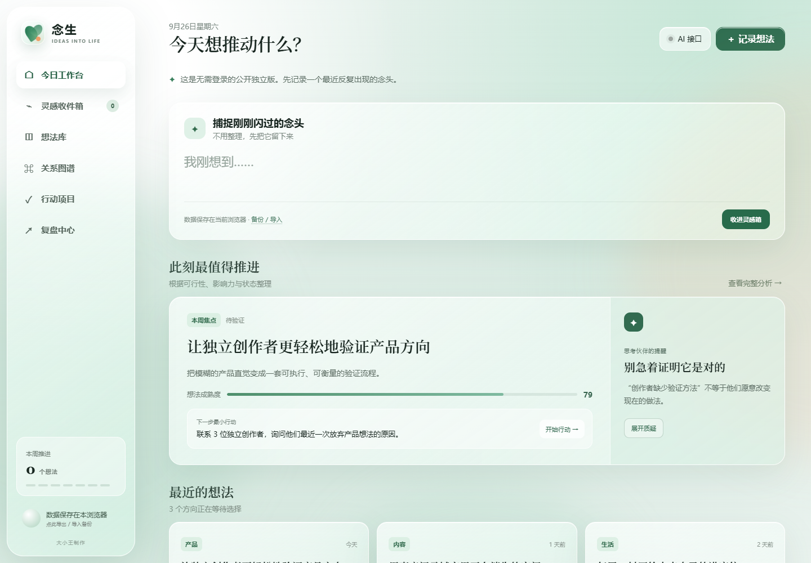
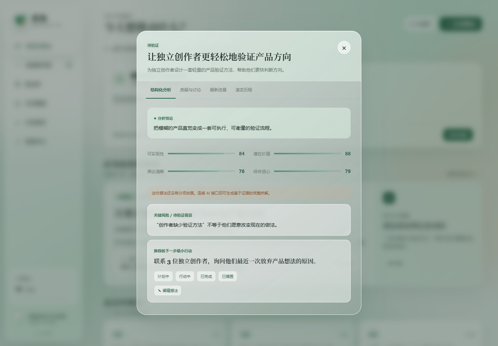
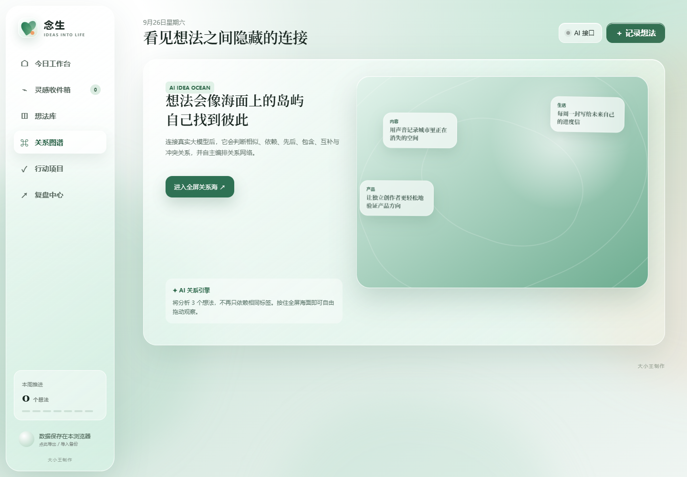
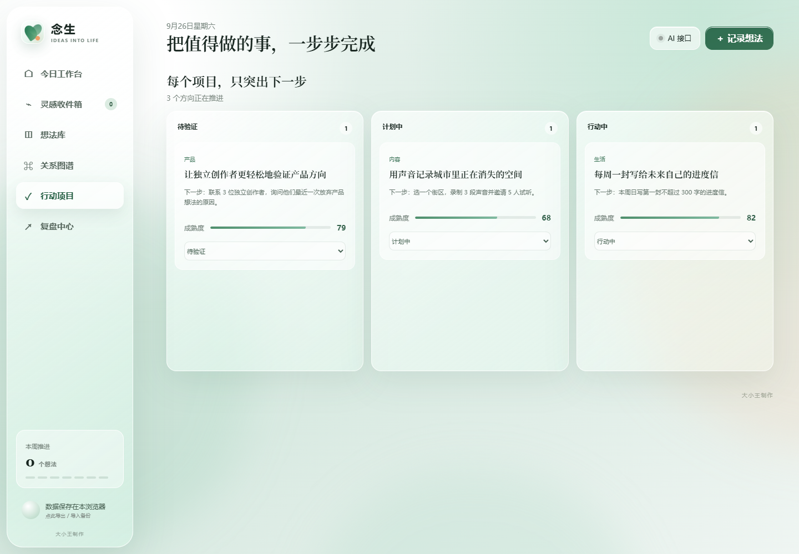
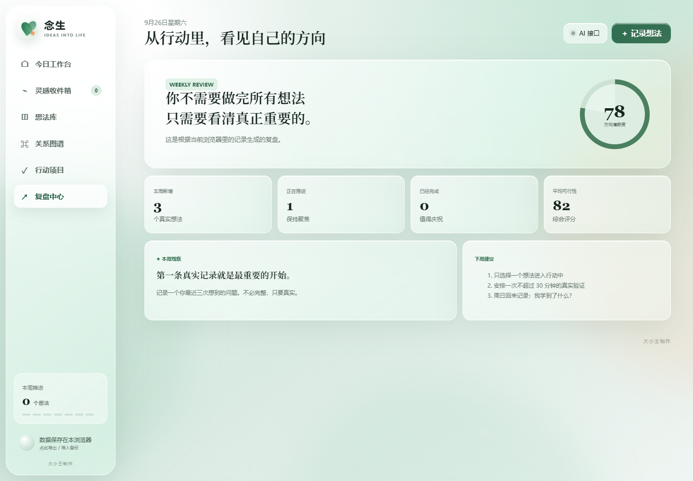
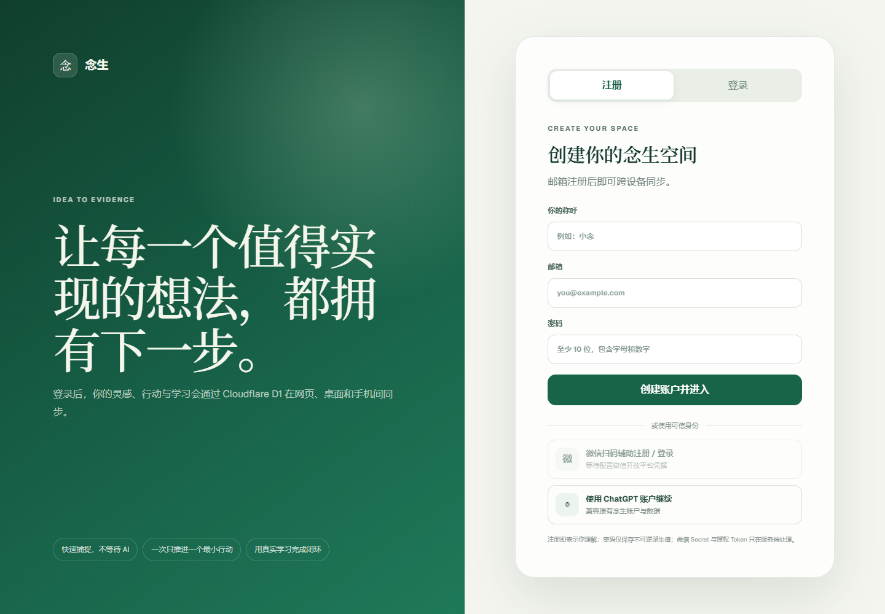

# 念生 · 产品使用说明

**让值得实现的想法，真正发生。**

念生是一款把灵感、判断、行动和学习连接起来的想法工作台。随手留下一个念头，梳理它的价值与风险，找到和其他想法的联系，再通过一次次小行动验证方向。

**[在线使用 →](https://app.nian-sheng.workers.dev)** · **[免登录体验 →](https://robertyoung446.github.io/nian-sheng/)**

正式版登录后可跨设备继续记录与推进；公开独立版适合先体验界面，数据保存在当前浏览器，可导出 / 导入备份。

> 配图为实际打开网站后的截图，拍摄于 2026 年 9 月 26 日。账户入口来自正式版；其余配图来自免登录公开独立版，展示内置示例。正式版的账户同步与多步行动流程以正式版界面为准。

## 念生能帮你做什么？

当想法很多、却不清楚该先做哪一个时，念生帮助你把注意力落到一个可以验证的下一步。它适合独立开发者和创作者梳理产品方向，也适合记录学习计划、生活改善或长期项目。

| 遇到的问题 | 在念生里怎么处理 | 得到什么 |
| --- | --- | --- |
| 灵感转瞬即逝，来不及整理 | 直接记录原始念头 | 一条可以继续完善的想法 |
| 不知道一个方向是否值得做 | 查看分析，讨论风险与假设 | 判断依据和验证方向 |
| 想法零散，容易重复投入 | 在关系图谱里观察关联 | 可合并、互补或需要先后推进的方向 |
| 目标太大，迟迟无法开始 | 拆成一个最小行动 | 明确的下一步与完成标准 |
| 做过很多事，却没有积累 | 记录结果和学习，定期复盘 | 可以回看、用于下一次决策的经验 |

## 核心流程

**捕捉灵感 → 分析与质疑 → 发现关联 → 最小行动 → 记录结果与学习 → 复盘并决定下一步**

不必一次完成所有环节。第一次使用，只需留下一个真实想法，读一遍关键风险，再选一个可以开始的小动作。

### 1. 留下想法：先记录，再整理

进入「今日工作台」，在「捕捉刚刚闪过的念头」中输入目标、问题、方案，或者一句还没想清楚的直觉，点击「收进灵感箱」。也可以从右上角「＋ 记录想法」开始。

例如：

> 我想为独立创作者做一个轻量的产品验证工具，帮助他们判断哪个方向值得继续投入。

记录后，到「灵感收件箱」逐条查看分析；到「想法库」按状态整理已有想法。正式版会先保存记录，再继续分析，让你尽快把念头留下来。

**作用：**把脑海里的直觉变成可讨论、可跟进的对象，无需先写出完整计划。

### 2. 看清想法：读分析，也追问假设

点击想法卡片或「查看完整分析」，打开「结构化分析」。先看结论，再查看可实现性、潜在价值、表达清晰和综合信心，重点阅读「关键风险 / 待验证假设」与推荐的下一步最小行动。

分数用于辅助比较方向，实际决策要结合证据。比如，“创作者缺少验证方法”这个观察，还不能说明他们愿意使用你的工具。

切换到「质疑与讨论」，请思考伙伴以建设性反方的角度挑战判断：

> 这个想法最薄弱的假设是什么？我应该先访谈谁，才能判断需求是否存在？

「最新进展」可以检索相关公开新闻，帮助补充背景；打开结果原文后，再判断它与自己的想法是否有关。

**作用：**把“我觉得可行”变成“我知道需要验证什么”，减少在未经验证的方向上投入过多精力。

### 3. 发现关联：把零散念头放在一起看

进入「关系图谱」，点击「进入全屏关系海」。拖动观察不同想法，点击节点查看详情。

连接真实模型后，关系引擎可分析相似、依赖、先后、包含、互补、冲突和资源复用关系。未连接模型时，以本地标签聚类帮助浏览。

例如，“访谈创作者”和“制作产品原型”可能有先后依赖；“整理访谈素材”和“写一篇创作方法文章”可能共享素材。图谱帮助你发现联系，再决定是否合并或调整顺序。

**作用：**看到单条记录之外的结构，减少重复工作，找到可以共同推进的方向。

### 4. 开始行动：只决定眼前这一步

进入「行动项目」，查看待验证、计划中和行动中的想法。每个项目突出下一步，方便选择今天真正要推进的一件事。

在正式版中，打开自己记录的想法，切换到「验证与行动」：

1. 写下一个最小行动，例如“联系 3 位创作者，询问最近一次放弃产品想法的原因”。
2. 填写完成标准，例如“整理 3 份访谈记录，找出反复出现的问题”。
3. 选择预计时长，点击「加入第 1 步」，然后「开始行动」。
4. 做完后写下“实际发生了什么”和“我学到了什么”，点击「完成这一步并收进来时路」。
5. 根据结果续写第 2 步，逐步积累自己的行动链。

**作用：**把大目标变成可完成、可观察结果的动作，并保留每一步带来的学习。公开独立版提供状态看板；正式版提供上述多步行动记录。

### 5. 回看与复盘：用学习决定下一步

进入「复盘中心」，查看新增想法、正在推进的方向、完成情况和相关指标。在正式版的「你的来时路」中，还可以回看每一步的完成标准、实际结果与学习。

每周可以用三个问题梳理自己的记录：

- 这周实际验证了什么，哪些判断发生了变化？
- 哪个方向值得继续，哪个方向可以暂时搁置？
- 下周只推进一个方向时，最小的一步是什么？

**作用：**让行动留下经验，用真实反馈调整方向，让下一次选择更有依据。

## 用一个例子走完流程

以下是使用方式示例，不是截图中的真实验证结果。

| 阶段 | 示例 |
| --- | --- |
| 记录 | 想做一个帮助独立创作者验证产品方向的工具 |
| 分析 | 核心风险：创作者有困扰，但未必愿意改变现有做法 |
| 质疑 | 他们现在怎样验证方向？为什么放弃过某个想法？ |
| 关联 | 将访谈、原型设计和内容创作放在一起，判断先后关系 |
| 第一步 | 访谈 3 位创作者，整理他们放弃想法的原因 |
| 结果与学习 | 记录实际反馈，区分真正需求和自己原先的猜测 |
| 下一步 | 如果问题成立，制作一个最小原型；否则调整或搁置方向 |
| 周复盘 | 回看访谈改变了哪些判断，选定下周的一次验证 |

## 第一次使用

### 选择入口

**正式版：[app.nian-sheng.workers.dev](https://app.nian-sheng.workers.dev)**

使用邮箱注册 / 登录，或使用页面提供的 ChatGPT 账户入口。在网页、桌面和手机上登录同一账户，可以继续自己的想法、行动与学习记录。微信入口是否可用取决于站点配置。

**公开独立版：[免登录体验](https://robertyoung446.github.io/nian-sheng/)**

打开即可浏览示例并记录自己的想法。数据保存在当前浏览器，通过「备份 / 导入」导出 JSON 或恢复备份；更换设备时需要自行迁移数据。

### 按需连接 AI

打开右上角「AI 接口」，选择 OpenAI、DeepSeek 或 OpenRouter，填写模型 ID 和自己的 API Key，再保存连接。正式版也可以使用站点管理员配置的模型；没有可用模型时，可先使用内置引擎体验基础分析。

当前线上版本会在此设备的浏览器中记住手动保存的 AI 配置，可在面板里清除。AI 配置不会随账户同步到其他设备。

### 建议的第一次体验

先记录一个最近反复想到的问题，读一遍关键风险，再写下一个能在 15～30 分钟内开始的小动作。完成后，留下实际结果和一条学习，下次回来就从这条记录继续。

## 开发与接口

本地运行、生产构建和模型服务端配置见 [开发与接口说明](docs/development.md)。
